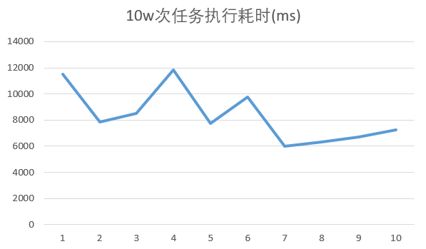
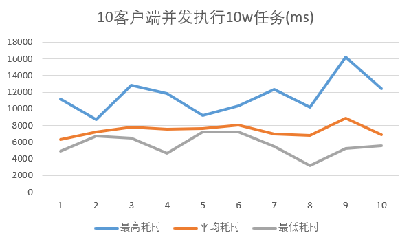

# yrpc
基于 boost Context2 编写的 异步rpc框架


## 一、yrpc简介
<br>
<br>
&emsp;yrpc是一个基于协程的rpc框架。使用的是boost 的 Context2 的 fcontext。其实原本是考虑了 系统的 ucontext ，但是听说 boost Context2 切换速度要比 ucontext 快，所以最后更换了 fcontext，所幸这两个接口用起来非常相似。

<br>

&emsp;yrpc 作为一个 rpc 框架本身实现了远程调用的功能。同时有熔断阈值设置，使用者可以通过修改配置文件设置服务端的熔断阈值，如果当前服务端到达阈值，就会返回一个 server busy 报文。客户端就认为本次调用失败。当然超时任务也是默认失败的。
<br>

&emsp;其次yrpc提供了两种异步调用的实现：Future和Async。使用方法如下

<br>
Future_Call

``` C++ 
    /*future 调用方式*/

    //响应报文
    std::shared_ptr<EchoRsp> buf;
    //注册调用
    auto ptr = client.result_long<EchoReq, EchoRsp>("Echo", req);
    //阻塞直到结果返回，有TryGet接口，Get接口也有提供超时选项，默认3s
    ptr->Get(buf); 
    //ptr->Try_Get();
```

<br>Async_Call
``` C++
    /*Async 调用方式*/

    client->async_call_long<EchoReq,EchoRsp>("Echo",req,[&times](EchoRsp& ptr){
        /* do something */
    }); 
```


<br>
&emsp;同时 yrpc 还实现了 这两种调用的短连接版本。可以让使用者灵活选择是每次调用创建一个连接然后销毁，还是建立长链接。

<br>
<br>

## 二、yrpc 结构
<br>

### Server Map

&emsp;管理服务的处理程序和编码解码器。处理程序使用std::bind 和 std::function 注册，编码解码器使用模板函数实现。

<br>

### RpcServer

&emsp;服务端启动时可以设置启动的线程数量，每个线程都是平行的，共享一个Service Map和一个Thread Pool。如果未设置线程数量，默认启动一个线程，每个线程包含独立的协程调度器。相当于服务端线程管理器

<br>

### RpcClient

&emsp;客户端开启即开启一个后台线程，此线程包含一个协程调度器，管理长链接、数据编解码、数据收发。每个RpcClient占用一个线程。

<br>

### Epoller

&emsp;协程调度器，是一个N:1协作式协程调度器，模拟多线程 Reactor模型，实现的线程内部以调度协程（loop 运行的协程）调用 Resume，其他协程被唤醒后，通过挂起、定时事件、IO事件的方式 Yield到调度协程。实现线程内的协程调度。

<br>

### CallManager

&emsp;客户端调用与连接管理器，实现了维持长连接、调用管理的功能。针对每种调用创建一个长连接。并实现Input Buffer 和 Output Buffer ，将tcp层数据部分缓存，并分割为 1440字节 每个包，尽量避免TCP粘包和拆包。

<br>

### ServerSingle
&emsp;真正的单个服务端线程，内部注册连接时回调协程、断开连接时回调协程、接受数据时回调协程等，是负责服务端逻辑的核心部分。

<br>

## 三、测试
<br>
<br>

&emsp;6月27日的v1.0版本测试结果不佳，长链接独占情况下单机 qps 5000。并发环境qps 3200左右。

### 单线程服务器测试

<br>



<br>

平均qps为 12782


    压测环境：VMWare ubuntu 20.04 虚拟机

    虚拟机核心数：2核

    内存：4G

    CPU：Intel(R) Core(TM) i5-9300H CPU@2.4GHz


### 并发服务器测试

<br>




<br>


平均qps为 13513


    压测环境：VMWare ubuntu 20.04 虚拟机

    虚拟机核心数：2核

    内存：4G

    CPU：Intel(R) Core(TM) i5-9300H CPU@2.4GHz


<br>
<br>

## 四、更新中
<br>

&emsp;正在修改长链接，之前是每个请求独占本次连接，这种情况下，服务端根本没有充分利用，应该设置为非独占，即可以同时发送多个请求，在客户端维护一个请求队列，然后根据这个请求队列发送和接受。这样从客户端来限流。服务端压力会小很多，同时并发效果估计更好。

